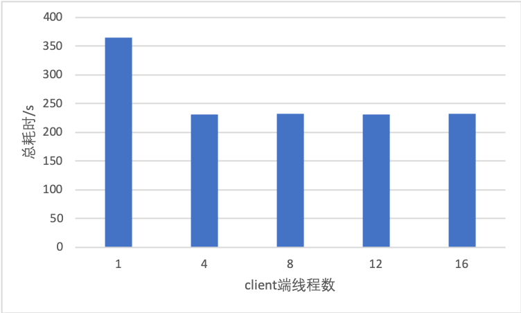

## 语义理解预测服务

示例中采用BERT模型进行语义理解预测，将文本表示为向量的形式，可以用来做进一步的分析和预测。

### 获取模型

示例中采用[Paddlehub](https://github.com/PaddlePaddle/PaddleHub)中的[BERT中文模型](https://www.paddlepaddle.org.cn/hubdetail?name=bert_chinese_L-12_H-768_A-12&en_category=SemanticModel)。
执行
```
python prepare_model.py
```
生成server端配置文件与模型文件，存放在serving_server_model文件夹
生成client端配置文件，存放在serving_client_conf文件夹

### 启动预测服务
执行
```
python bert_server.py serving_server_model 9292 #启动cpu预测服务
```
或者
```
python bert_gpu_server.py serving_server_model 9292 #在gpu 0上启动gpu预测服务
```

### 执行预测

执行
```
sh get_data.sh
```
获取中文样例数据

执行
```
head data-c.txt | python bert_client.py
```
将预测样例数据中的前十条样例，并将向量表示打印到标准输出。

### Benchmark

模型：bert_chinese_L-12_H-768_A-12

设备：GPU V100 * 1

环境：CUDA 9.2，cudnn 7.1.4

测试中将样例数据中的1W个样本复制为10W个样本，每个client线程发送线程数分之一个样本，batch size为1，max_seq_len为20，时间单位为秒.

在client线程数为4时，预测速度可以达到432样本每秒。
由于单张GPU内部只能串行计算，client线程增多只能减少GPU的空闲时间，因此在线程数达到4之后，线程数增多对预测速度没有提升。

| client  thread num | prepro | client infer | op0   | op1    | op2  | postpro | total  |
| ------------------ | ------ | ------------ | ----- | ------ | ---- | ------- | ------ |
| 1                  | 3.05   | 290.54       | 0.37  | 239.15 | 6.43 | 0.71    | 365.63 |
| 4                  | 0.85   | 213.66       | 0.091 | 200.39 | 1.62 | 0.2     | 231.45 |
| 8                  | 0.42   | 223.12       | 0.043 | 110.99 | 0.8  | 0.098   | 232.05 |
| 12                 | 0.32   | 225.26       | 0.029 | 73.87  | 0.53 | 0.078   | 231.45 |
| 16                 | 0.23   | 227.26       | 0.022 | 55.61  | 0.4  | 0.056   | 231.9  |

总耗时变化规律如下：  

